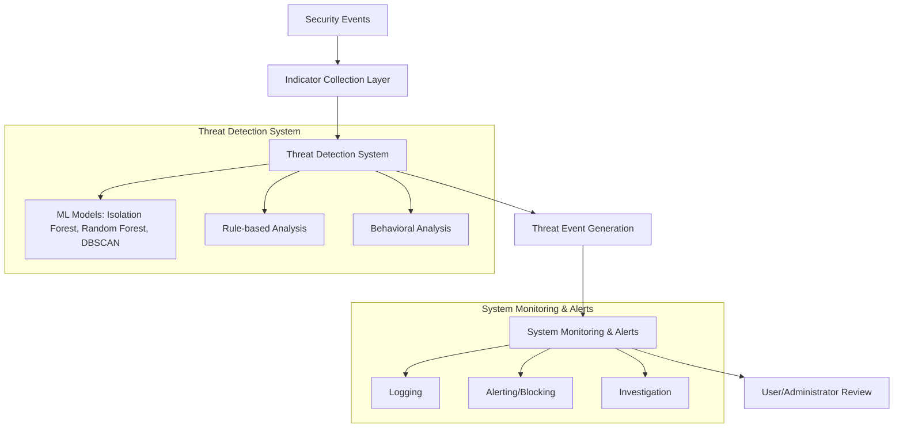

# AppArmor

[](https://gitlab.com/apparmor/apparmor/commits/master)
[](https://gitlab.com/apparmor/apparmor/pipelines)
[](https://bestpractices.coreinfrastructure.org/projects/1699)

------------
Introduction
------------
AppArmor protects systems from insecure or untrusted processes by
running them in restricted confinement, while still allowing processes
to share files, exercise privilege and communicate with other processes.
AppArmor is a Mandatory Access Control (MAC) mechanism which uses the
Linux Security Module (LSM) framework. The confinement's restrictions
are mandatory and are not bound to identity, group membership, or object
ownership. The protections provided are in addition to the kernel's
regular access control mechanisms (including DAC) and can be used to
restrict the superuser.

-------------------------------
Automated Threat Detection System
-------------------------------

AppArmor now includes an advanced Automated Threat Detection System located in `utils/threat-detection/threat_detector.py`. This Python-based tool leverages machine learning algorithms to identify security threats and anomalies in real-time, supporting AppArmor's Zero Trust Architecture.

Key features:
- Real-time threat and anomaly detection using ML models (Isolation Forest, Random Forest, DBSCAN)
- Rule-based and behavioral analysis
- Threat event logging and mitigation actions
- Extensible threat models for malware, privilege escalation, data exfiltration, and lateral movement

Dependencies:
- Python >= 3.3
- numpy
- pandas
- scikit-learn
- joblib
- pyyaml

To install dependencies in the AppArmor virtual environment:
```sh
c:/Users/Acer/Desktop/apparmor-test/apparmor/.venv/Scripts/python.exe -m pip install numpy pandas scikit-learn joblib pyyaml
```

Usage:
```sh
c:/Users/Acer/Desktop/apparmor-test/apparmor/.venv/Scripts/python.exe utils/threat-detection/threat_detector.py --start
```
Other options:
- `--config <path>`: Specify a custom configuration file
- `--stats`: Show threat statistics
- `--events <N>`: Show threat events from last N hours
- `--train <datafile>`: Train models with historical data

See the script for more details and command-line options.

The AppArmor kernel module and accompanying user-space tools are
available under the GPL license (the exception is the libapparmor
library, available under the LGPL license, which allows change_hat(2)
and change_profile(2) to be used by non-GPL binaries).

For more information, you can read the techdoc.pdf (available after
building the parser) and by visiting the https://apparmor.net/ web
site.

----------------
Getting in Touch
----------------

Please send all complaints, feature requests, rants about the software,
and questions to the
[AppArmor mailing list](https://lists.ubuntu.com/mailman/listinfo/apparmor).

Bug reports can be filed against the AppArmor project on
[GitLab](https://gitlab.com/apparmor/apparmor/-/issues) or reported to the mailing
list directly for those who wish not to register for an account on
GitLab. See the
[wiki page](https://gitlab.com/apparmor/apparmor/wikis/home#reporting-bugs)
for more information.

Security issues can be filed in GitLab by opening up a new [issue](https://gitlab.com/apparmor/apparmor/-/issues) and selecting the tick box ```This issue is confidential and should only be visible to team members with at least Reporter access.``` or directed to `security@apparmor.net`. Additional details can be found
in the [wiki](https://gitlab.com/apparmor/apparmor/wikis/home#reporting-security-vulnerabilities).


--------------
Privacy Policy
--------------

The AppArmor security project respects users privacy and data and does not collect data from or on its users beyond what is required for a given component to function.

The AppArmor kernel security module will log violations to the audit subsystem, and those will be logged/forwarded/recorded on the user's system(s) according to how the administrator has logging configured. Again this is not forwarded to or collected by the AppArmor project.

The AppArmor userspace tools do not collect information on the system user beyond the logs and information needed to interact with the user. This is not forwarded to, nor collected by the AppArmor project.

Users may submit information as part of an email, bug report or merge request, etc. and that will be recorded as part of the mailing list, bug/issue tracker, or code repository but only as part of a user initiated action.

The AppArmor project does not collect information from contributors beyond their interactions with the AppArmor project, code, and community. However contributors are subject to the terms and conditions and privacy policy of the individual platforms (currently GitLab) should they choose to contribute through those platforms. And those platforms may collect data on the user that the AppArmor project does not.

Currently GitLab requires a user account to submit patches or report bugs and issues. If a contributor does not wish to create an account for these platforms the mailing list is available. Membership in the list is not required. Content from non-list members will be sent to moderation, to ensure that it is on topic, so there may be a delay in choosing to interact in this way.


-------------
Source Layout
-------------

AppArmor consists of several different parts:

```
binutils/	source for basic utilities written in compiled languages
changehat/	source for using changehat with Apache, PAM and Tomcat
common/		common makefile rules
desktop/	empty
kernel-patches/	compatibility patches for various kernel versions
libraries/	libapparmor source and language bindings
parser/		source for parser/loader and corresponding documentation
profiles/	configuration files, reference profiles and abstractions
tests/		regression and stress testsuites
utils/		high-level utilities for working with AppArmor
```

--------------------------------------
Important note on AppArmor kernel code
--------------------------------------

While most of the kernel AppArmor code has been accepted in the
upstream Linux kernel, a few important pieces were not included. These
missing pieces unfortunately are important bits for AppArmor userspace
and kernel interaction; therefore we have included compatibility
patches in the kernel-patches/ subdirectory, versioned by upstream
kernel (2.6.37 patches should apply cleanly to 2.6.38 source).

Without these patches applied to the kernel, the AppArmor userspace
will not function correctly.

------------------------------------------
Building and Installing AppArmor Userspace
------------------------------------------

To build and install AppArmor userspace on your system, build and install in
the following order. Some systems may need to export various python-related
environment variables to complete the build. For example, before building
anything on these systems, use something along the lines of:

```
$ export PYTHONPATH=$(realpath libraries/libapparmor/swig/python)
$ export PYTHON=/usr/bin/python3
$ export PYTHON_VERSION=3
$ export PYTHON_VERSIONS=python3
```

Note that, in general, the build steps can be run in parallel, while the test
steps do not gain much speedup from being run in parallel. This is because the
test steps spawn a handful of long-lived test runner processes that mostly
run their tests sequentially and do not use `make`'s jobserver. Moreover,
process spawning overhead constitutes a significant part of test runtime, so
reworking the test harnesses to add parallelism (which would be a major undertaking
for the harnesses that do not have it already) would not produce much of a speedup.

### libapparmor:

```
$ cd ./libraries/libapparmor
$ sh ./autogen.sh
$ sh ./configure --prefix=/usr --with-perl --with-python # see below
$ make -j $(nproc)
$ make check
$ make install
```

[an additional optional argument to libapparmor's configure is --with-ruby, to
generate Ruby bindings to libapparmor.]


### Binary Utilities:

```
$ cd binutils
$ make -j $(nproc)
$ make check
$ make install
```

### Parser:

```
$ cd parser
$ make -j $(nproc)		# depends on libapparmor having been built first
$ make -j $(nproc) tst_binaries		# a build step of make check that can be parallelized
$ make check
$ make install
```


### Utilities:

```
$ cd utils
$ make -j $(nproc)
$ make check PYFLAKES=/usr/bin/pyflakes3
$ make install
```

### Apache mod_apparmor:

```
$ cd changehat/mod_apparmor
$ make -j $(nproc)		# depends on libapparmor having been built first
$ make install
```


### PAM AppArmor:

```
$ cd changehat/pam_apparmor
$ make -j $(nproc)		# depends on libapparmor having been built first
$ make install
```


### Profiles:

```
$ cd profiles
$ make
$ make check	# depends on the parser having been built first
$ make install
```

Note that the empty local/* profile sniplets no longer get created by default.
If you want them, run `make local` before running `make check`.

[Note that for the parser, binutils, and utils, if you only wish to build/use
 some of the locale languages, you can override the default by passing
 the LANGS arguments to make; e.g. make all install "LANGS=en_US fr".]

-------------------
AppArmor Testsuites
-------------------

A number of testsuites are in the AppArmor sources. Most have documentation on
usage and how to update and add tests. Below is a quick overview of their
location and how to run them.


Using spread with local virtual machines
----------------------------------------

It may be convenient to use the spread tool to provision and run the test suite
in an ephemeral virtual machine. This allows testing in isolation from the
host, as well as testing across different commonly used distributions and their
real kernels.

Image Garden is available as a snap. If you wish to use it this way then snap
then install the snap with:

```sh
sudo snap install image-garden
```

If you need to install snapd first, see https://snapcraft.io/docs/installing-snapd

Alternatively you may build image-garden and spread from source, and install
dependencies manually.

```sh
sudo apt install git golang whois ovmf genisoimage qemu-utils qemu-system
go install github.com/snapcore/spread/cmd/spread@latest
git clone https://gitlab.com/zygoon/image-garden
make -C image-garden
sudo make -C image-garden install
image-garden make ubuntu-cloud-24.10.x86_64.run
cd $APPARMOR_PATH
git clean -xdf
~/go/bin/spread -artifacts ./spread-artifacts -v ubuntu-cloud-24.10
# or ~/go/bin/spread -v garden:ubuntu-cloud-24.04:tests/regression/apparmor:at_secure
```

Running the `run_spread.sh` script, with `image-garden` snap installed or with
`spread` on `PATH` will run all the tests across several supported systems
(Debian, Ubuntu and openSUSE).

If you include a `bzImage` file in the root of the repository then that kernel
will be used in the integration test. Please look at `spread.yaml` for details.

Regression tests
----------------
For details on structure and adding tests, see
tests/regression/apparmor/README.

To run:

### Regression tests - using apparmor userspace installed on host
```
$ cd tests/regression/apparmor (requires root)
$ make -j $(nproc) USE_SYSTEM=1
$ sudo make tests USE_SYSTEM=1
$ sudo bash open.sh -r	 # runs and saves the last testcase from open.sh
```

### Regression tests - using apparmor userspace from the tree.
- [build libapparmor](#libapparmor)
- [build binutils](#binary-utilities)
- [build apparmor parser](#parser)
- [build Pam apparmor](#pam-apparmor)

```
$ cd tests/regression/apparmor (requires root)
$ make -j $(nproc)
$ sudo make tests
$ sudo bash open.sh -r	 # runs and saves the last testcase from open.sh
```

Parser tests
------------
For details on structure and adding tests, see parser/tst/README.

To run:

```
$ cd parser/tst
$ make
$ make tests
```

Libapparmor
-----------
For details on structure and adding tests, see libraries/libapparmor/README.

```
$ cd libraries/libapparmor
$ make check
```

Utils
-----
Tests for the Python utilities exist in the test/ subdirectory.

```
$ cd utils
$ make check
```

The aa-decode utility to be tested can be overridden by
setting up environment variable APPARMOR_DECODE; e.g.:

```
$ APPARMOR_DECODE=/usr/bin/aa-decode make check
```

Profile checks
--------------
A basic consistency check to ensure that the parser and aa-logprof parse
successfully the current set of shipped profiles. The system or other
parser and logprof can be passed in by overriding the PARSER and LOGPROF
variables.

```
$ cd profiles
$ make && make check
```

Stress Tests
------------
To run AppArmor stress tests:

```
$ make all
```

Use these:

```
$ ./change_hat
$ ./child
$ ./kill.sh
$ ./open
$ ./s.sh
```

Or run all at once:

```
$ ./stress.sh
```

Please note that the above will stress the system so much it may end up
invoking the OOM killer.

To run parser stress tests (requires /usr/bin/ruby):

```
$ ./stress.sh
```

(see stress.sh -h for options)

Coverity Support
----------------
Coverity scans are available to AppArmor developers at
https://scan.coverity.com/projects/apparmor.

In order to submit a Coverity build for analysis, the cov-build binary
must be discoverable from your PATH. See the "To Setup" section of
https://scan.coverity.com/download?tab=cxx to obtain a pre-built copy of
cov-build.

To generate a compressed tarball of an intermediate Coverity directory:

```
$ make coverity
```

The compressed tarball is written to
apparmor-<SNAPSHOT_VERSION>-cov-int.tar.gz, where <SNAPSHOT_VERSION>
is something like 2.10.90~3328, and must be uploaded to
https://scan.coverity.com/projects/apparmor/builds/new for analysis. You must
include the snapshot version in Coverity's project build submission form, in
the "Project Version" field, so that it is quickly obvious to all AppArmor
developers what snapshot of the AppArmor repository was used for the analysis.

-----------------------------------------------
Building and Installing AppArmor Kernel Patches
-----------------------------------------------

TODO


-----------------
Required versions
-----------------

The AppArmor userspace utilities are written with some assumptions about
installed and available versions of other tools. This is a (possibly
incomplete) list of known version dependencies:

The Python utilities require a minimum of Python 3.3.

The aa-notify tool's Python dependencies can be satisfied by installing the
following packages (Debian package names, other distros may vary):
* python3-notify2
* python3-psutil
* python3-sqlite (part of the python3.NN-stdlib package)
* python3-tk
* python3-ttkthemes
* python3-gi

Perl is no longer needed since none of the utilities shipped to end users depend
on it anymore.

Most shell scripts are written for POSIX-compatible sh. aa-decode expects
bash, probably version 3.2 and higher.

---------------------------------------------
AppArmor System Documentation (Full Overview)
---------------------------------------------

See `AppArmor_System_Documentation.txt` for a comprehensive guide to the AppArmor Zero Trust Architecture, including:
- Overview and major updates
- Features and modular source layout
- Detailed module descriptions
- System workflow diagrams (text and Mermaid.js)
- Implementation details
- Configuration and dependencies
- Usage instructions
- Testing and validation
- Contact and support information

---

AppArmor Zero Trust Architecture - System Documentation
======================================================

Overview
--------
AppArmor is a Mandatory Access Control (MAC) system for Linux, providing process confinement and security enforcement. The project now includes an advanced Automated Threat Detection System, supporting Zero Trust principles and real-time security monitoring.

Major Updates
-------------
- Integration of Automated Threat Detection System (Python-based, ML-powered)
- Enhanced threat models for malware, privilege escalation, data exfiltration, and lateral movement
- Real-time event logging, mitigation, and behavioral analysis
- Modular codebase with kernel patches, user-space tools, libraries, and utilities

Features
--------
1. **Automated Threat Detection System**
   - Location: `utils/threat-detection/threat_detector.py`
   - Machine learning models: Isolation Forest, Random Forest, DBSCAN
   - Rule-based and behavioral analysis
   - Threat event generation, logging, and mitigation
   - Extensible threat models (malware, privilege escalation, data exfiltration, lateral movement)
   - Configurable via YAML file

2. **Modular Source Layout**
   - `binutils/`: Compiled utilities
   - `changehat/`: Apache, PAM, Tomcat integration
   - `common/`: Shared makefile rules
   - `kernel-patches/`: Kernel compatibility patches
   - `libraries/`: libapparmor and language bindings
   - `parser/`: Policy parser and loader
   - `profiles/`: Reference profiles and abstractions
   - `tests/`: Regression and stress tests
   - `utils/`: High-level utilities, including threat detection

Detailed Module Overview
-----------------------
- **binutils/**: C utilities for AppArmor management (aa_enabled.c, aa_exec.c, aa_load.c, aa_status.c, cJSON.c/h). These provide command-line tools for enabling, executing, loading, and checking AppArmor status, and handle JSON parsing for configuration and output.
- **changehat/**: Integration modules for Apache (mod_apparmor/), PAM (pam_apparmor/), and Tomcat (tomcat_apparmor/). These allow dynamic profile changes for services, enhancing security boundaries.
- **common/**: Shared scripts and makefile rules (Make-po.rules, Make.rules, Version). Ensures consistent build and configuration across all modules.
- **kernel-patches/**: Compatibility patches for various Linux kernel versions (2.x, 3.x, 4.x, v4.x). These patches are required for full AppArmor functionality on different kernels.
- **libraries/**: Core libapparmor library and bindings (libapparmor/). Provides APIs for interacting with AppArmor from C, Python, and other languages, supporting profile management and enforcement.
- **parser/**: Policy parser and loader (apparmor_parser.pod, parser_main.c, binary_profile_serialization.c, adaptive_cache.c/h, af_rule.cc/h, cond_expr.cc/h, etc.). Handles parsing, validation, and serialization of AppArmor profiles and rules.
- **profiles/**: Reference profiles and abstractions for AppArmor (apparmor/, apparmor.d/). Defines security policies for applications and system components.
- **tests/**: Regression, stress, and unit tests (bin/, profiles/, regression/, snapd/, stress/, unit/). Validates AppArmor’s robustness and correctness across scenarios.
- **utils/**: High-level utilities (aa-* tools, logprof.conf, notify.conf, python-tools-setup.py, severity.db, etc.). Includes tools for auditing, profiling, notification, sandboxing, and more.
- **utils/threat-detection/**: Main threat detection Python script (threat_detector.py). Implements ML-based, rule-based, and behavioral threat detection, event generation, and mitigation.

System Workflow Diagram
----------------------

System Workflow (Textual Diagram):

```
+-------------------+
|  Security Events  |
+-------------------+
          |
          v
+-----------------------------+
|  Indicator Collection Layer |
+-----------------------------+
          |
          v
+-----------------------------+
| Threat Detection System     |
|  - ML Models (Anomaly,      |
|    Behavior, Clustering)    |
|  - Rule-based Analysis      |
|  - Behavioral Analysis      |
+-----------------------------+
          |
          v
+-----------------------------+
| Threat Event Generation     |
|  - Event Logging            |
|  - Mitigation Actions       |
+-----------------------------+
          |
          v
+-----------------------------+
| System Monitoring & Alerts  |
|  - Logging                  |
|  - Alerting/Blocking        |
|  - Investigation            |
+-----------------------------+
          |
          v
+-----------------------------+
| User/Administrator Review   |
+-----------------------------+
```

Mermaid.js Workflow Diagram
--------------------------



Implementation Details
----------------------
- Threat detection uses ML models for anomaly and behavior classification
- Rule-based detection for known threat patterns
- Behavioral analysis for unusual activity
- Threat events include timestamp, type, severity, confidence, source, target, description, indicators, mitigation, and status
- Mitigation actions: block, alert, investigate, monitor
- Integration with system logging and monitoring tools

Configuration
-------------
- Main configuration via YAML file (see `threat_detector.py`)
- Customizable detection thresholds, enabled models, monitoring intervals
- Example config snippet:
  ```yaml
  detection:
    enable_ml_detection: true
    confidence_threshold: 0.8
    severity_threshold: 0.7
  models:
    anomaly_detector: isolation_forest
    behavior_classifier: random_forest
    clustering: dbscan
  monitoring:
    check_interval: 60
    max_events: 10000
    retention_days: 30
  ```

Dependencies
------------
- Python >= 3.3
- numpy
- pandas
- scikit-learn
- joblib
- pyyaml

Install dependencies:
```sh
c:/Users/Acer/Desktop/apparmor-test/apparmor/.venv/Scripts/python.exe -m pip install numpy pandas scikit-learn joblib pyyaml
```

Usage
-----
Run threat detection:
```sh
c:/Users/Acer/Desktop/apparmor-test/apparmor/.venv/Scripts/python.exe utils/threat-detection/threat_detector.py --start
```
Other options:
- `--config <path>`: Specify custom config file
- `--stats`: Show threat statistics
- `--events <N>`: Show threat events from last N hours
- `--train <datafile>`: Train models with historical data

Testing & Validation
--------------------
- Regression and stress tests in `tests/`
- Spread tool for VM-based testing
- Parser, libapparmor, and profile checks

Contact & Support
-----------------
- Mailing list: https://lists.ubuntu.com/mailman/listinfo/apparmor
- Bug reports: https://gitlab.com/apparmor/apparmor/-/issues
- Security issues: security@apparmor.net

For more details, see README.md and source documentation in each module.

# ...existing code...
